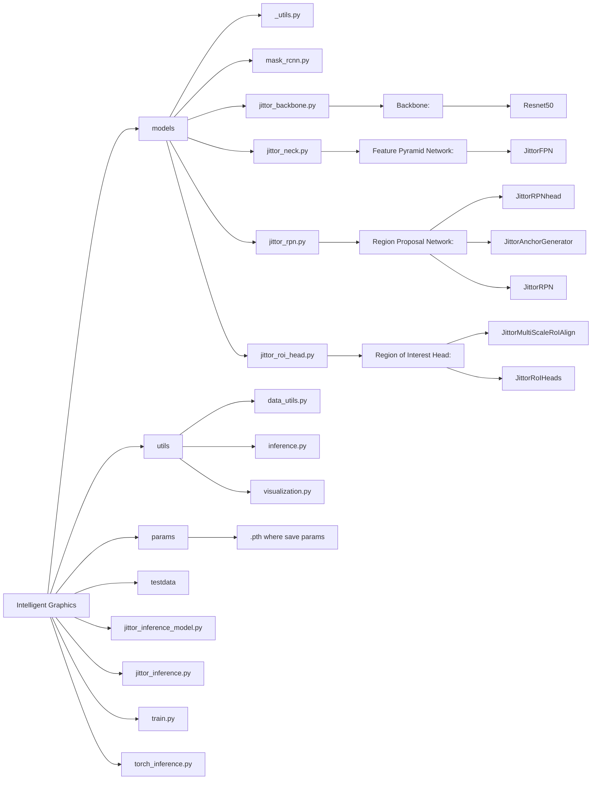
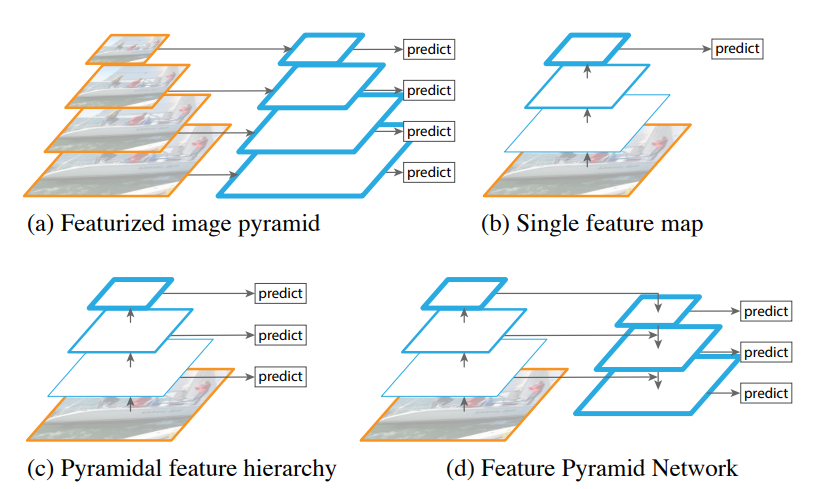
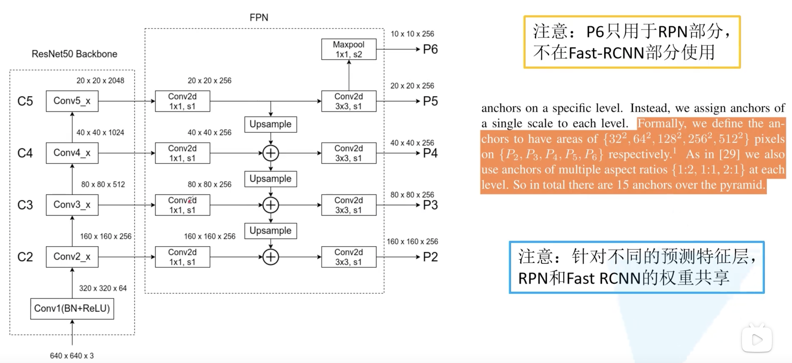
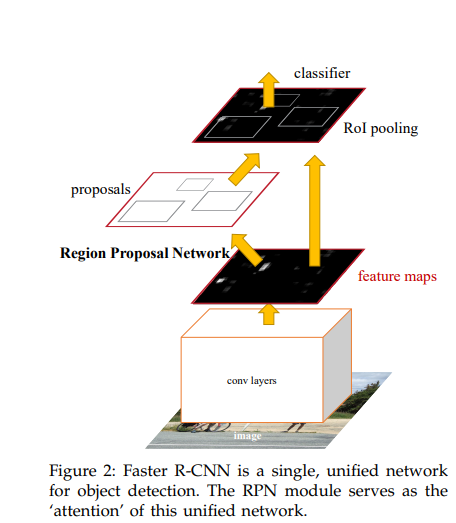
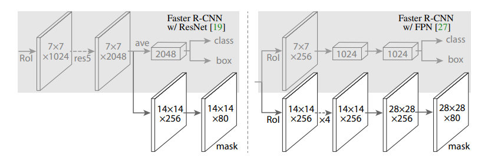
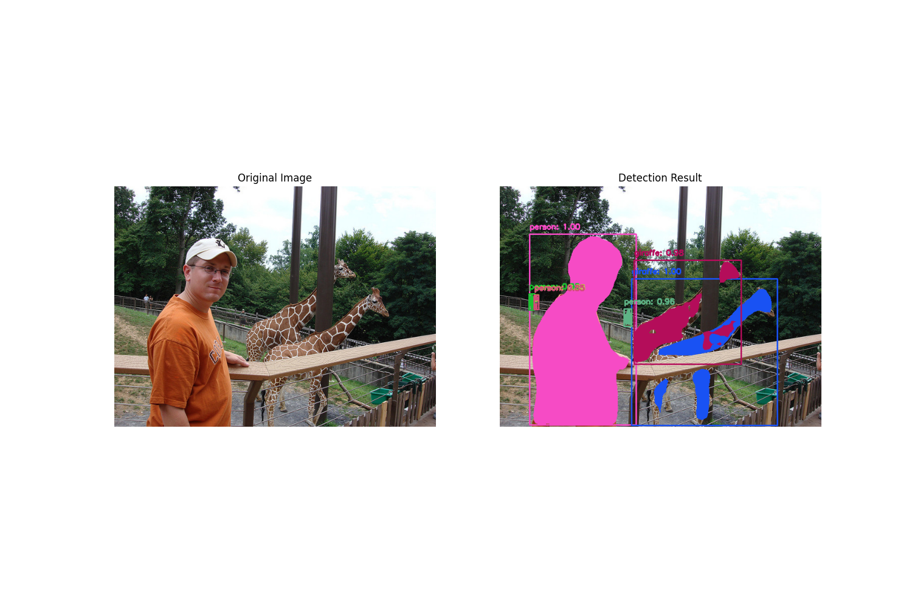

# Mask R-CNN Based Jittor

## Introduction
本项目是一个jittor框架下的基于深度学习的图像实例分割项目，参考了torch的实现
实现了 `Mask R-CNN` 模型，对图像中的实例进行分割，同时对实例进行分类。

`Mask R-CNN` (https://arxiv.org/abs/1703.06870)是一种用于目标检测和实例分割的深度学习模型，
其对于2015年提出的 `Fast R-CNN` 做出了一些改进，通过增加 `Mask` 分支
(`Mask RoIAlign`, `Mask Head`, `Mask Predictor`) 从而对于实例分割有更好的效果


训练使用的数据集是`coco2017`数据集，包含80个类别的实例，包括人、动物、交通工具等。
``` python
# COCO数据集的类别名称（81个类别，包括背景类）
COCO_CLASSES = [
    'background',  # 索引0为背景
    'person', 'bicycle', 'car', 'motorcycle', 'airplane', 'bus', 'train', 'truck', 
    'boat', 'traffic light', 'fire hydrant', 'stop sign', 'parking meter', 'bench', 
    'bird', 'cat', 'dog', 'horse', 'sheep', 'cow', 'elephant', 'bear', 'zebra', 
    'giraffe', 'backpack', 'umbrella', 'handbag', 'tie', 'suitcase', 'frisbee', 
    'skis', 'snowboard', 'sports ball', 'kite', 'baseball bat', 'baseball glove', 
    'skateboard', 'surfboard', 'tennis racket', 'bottle', 'wine glass', 'cup', 
    'fork', 'knife', 'spoon', 'bowl', 'banana', 'apple', 'sandwich', 'orange', 
    'broccoli', 'carrot', 'hot dog', 'pizza', 'donut', 'cake', 'chair', 'couch', 
    'potted plant', 'bed', 'dining table', 'toilet', 'tv', 'laptop', 'mouse', 
    'remote', 'keyboard', 'cell phone', 'microwave', 'oven', 'toaster', 'sink', 
    'refrigerator', 'book', 'clock', 'vase', 'scissors', 'teddy bear', 'hair drier', 
    'toothbrush'
]
```
## Project Structure


## Model Structure



上图展示了resnet50和FPN的结构和之间的关系，从图中可以直观发现，图像在左侧的`Resnet50 Backbone`中经过多次卷积和池化操作
得到了4个不同尺寸的特征图。然后针对每一个backbone上的特征图，FPN网络先使用1x1的卷积核进行处理，原始论文中
1x1卷积核的个数是 256，因此最终得到的特征图的通道数是256。这个操作的目的是调整`Resnet50 Backbone`上不同
特征图的 `channels`，从而保证后面的特征融合操作能够顺利进行。

在将不同尺寸的特征图融合之后，FPN网络再次使用3x3的卷积核对融合后的特征图进行处理，得到最终的特征图。
在原论文描述中，将在P5的基础上进行一个下采样操作，图中使用步距为2的最大池化实现

还有一个问题：如何知道预测的 `proposal` 应该映射到哪一个特征图上。论文中将特征金字塔视作图像金字塔生成出来的，
并给出了一个对应的公式
$$
k = k_0 + \log_2(\sqrt{wh}/224)
$$
其中 $k_0$ 是一个常数，$k$对应着 $P_2 \sim P_5$，$w$ 和 $h$ 是 `proposal` 的宽和高，224是一个常数。这个公式的目的是根据 `proposal` 的
宽和高来确定其应该映射到特征金字塔的哪一层上,如果 $w$ 和 $h$ 在原图上都等于224的一半，也就是112的话，此时
$k$计算出来就是 $4-1=3$,也就是越小的目标，对应的 $k$ 越小

通过这个FPN网络，相比于Fast R-CNN，增加的一个FPN网络，在计算量增加不大的情况下，提高了处理不同尺寸的特征图的能力，
后面可以发现，对于尺寸较小的实例，也能取得不错的效果



上图展示了RPN网络的结构，在获得由FPN网络处理后的特征图之后， 虽然有很多可能的地方，但是不可能一个区域一个区域处理，
因此RPN网络的目的是快速找到一些潜在感兴趣的区域（候选区域），也就是图中的 `proposal`

而RPN网络的核心思想是：在`feature maps`传入RPN网络后将输出分成两个不同的任务，一个是分类任务，一个是回归任务：

1. 分类分支（Objectness Score）,判断每个位置是否有物体：
   - 使用1x1卷积层将特征图转换为形状`[Batch Size, num_anchors * 2, 高度, 宽度]`的张量，这里的 $2$ 代表
   二分类：前景（有物体）或背景（无物体）。
   - 在本次实验中，不考虑背景类别，只考虑前景类别，因此只需要输出前景的概率即可，也就是输出的形状为
   `[Batch Size, num_anchors, 高度, 宽度]`因此其实际含义就是该位置（像素）是否存在物体的概率或者说`score`

   
2. 回归分支（Bounding Box Regression），预测锚框的边框调整参数：
   - 使用1x1卷积层将特征图转换为形状`[Batch Size, num_anchors * 4, 高度, 宽度]`的张量，这里的“4”代表
   边框的 $4$ 个参数调整：水平偏移 $dx$，垂直偏移 $dy$，宽度调整 $dw$，高度调整 $dh$。 这些偏移值用于调整
   `anchor`的位置和大小，使其更好地匹配实际物体的位置

3. Anchor机制：
   - 在特征图的每个位置(像素)上，都会预设 $n$ 个尺寸和 $m$ 个比例的anchor boxes，也就是对于一个(h, w)的特征图
    会有 $h \times w \times n \times m$ 个anchor boxes,这些anchor作为基础框，通过回归分支预测的偏移值进行调整
   
4. 训练过程：
   - 对于每个anchor，计算它与真实物体框（ground truth）的IoU,IoU > 0.7的anchor被标记为正样本（前景）, 
   IoU < 0.3的anchor被标记为负样本（背景）,其他的anchor不参与训练，其中分类器的损失采用二分类交叉熵损失，边界框回归使用Smooth L1损失
   
5. 后处理，过滤并选择最好的一些预测(proposals)：
   - 首先从不同分辨率的特征图中分别选择一些`proposals`，这些`proposlas`按照分类分支输出的 前景概率作为`proposals`的得分，
   对`proposals`按得分进行排序，选择得分最高的前 $N$ 个`proposals`作为输出
   - 接着按照提前设定的`minsize`,`score_thresh`和`nms_thresh`对`proposals`进行过滤，分别用于移除小尺寸的`proposals`，
    低得分的`proposals`和重叠度较高的`proposals`。最终从剩余的`proposals`中选择前 $M$ 个`proposals`作为输出
6. 输出：
   - 最终输出的`proposals`是一个形状为`[Batch Size, M, 4]`的张量，其中`M`是选择的`proposals`的数量，`4`代表边框的四个参数
   - 这些输出将传递到最后的`Mask Head`和`Box Head`中，用于进一步的处理

通过这种设计，RPN网络能够快速且有效地生成可能包含物体的候选区域，大大减少了需要处理的区域数量，提高了整个网络的效率。
同时，由于采用了多尺寸和多比例的anchor机制，使得网络能够很好地处理不同大小和形状的物体。



RoI Head是Mask R-CNN的核心部分，负责对RPN网络输出的`proposals`和FPN网络输出的`features`进行进一步处理，包括目标检测和实例分割。
上图展示了RoI Head的结构，这是Mask R-CNN最重要的改进部分。其主要由以下 3 个部分组成：
- RoI Align：从 RPN 的候选区域中提取特征。
- 分类和边界框回归：对每个候选区域进行精细分类，并调整边界框的位置和大小。
- 掩码预测：为每个实例生成分割掩码。

1. RoIAlign替代RoIPooling：
   - Fast R-CNN中使用的RoIPooling在进行特征映射时存在两次量化操作：将proposal边框坐标从原图映射到特征图时的量化和
   将不规则大小的特征区域划分成固定大小的格子时的量化，这种量化会导致特征图和原始图像的位置不对齐，对分割任务的影响尤其明显
   - Mask R-CNN提出的RoIAlign通过双线性插值完全避免了量化操作，保持了特征的精确空间位置信息，其接受的输入是
   `proposals`,`features`和`image_origin_size`，输出
   
2. 网络结构分支：
   RoI Head分成两个平行的分支：
   
   - Box分支：首先通过两个全连接层(fc)对每个 $n \times n$ 的 RoI 特征图进行处理，然后分别通过`class`和`box`分支进行分类和边界框回归
   输出形状分别是 `[proposals.shape[0], num_classes]` 和 `[proposals.shape[0], num_classes * 4]`,`proposals.shape[0]`为RPN网络输出的
    `proposals`的数量，`num_classes`为类别数量，`4`代表边框的四个参数,从而得到准确的检测框和类别
   
   - Mask分支：采用FCN（全卷积网络）结构对RoI特征进行处理，具体包括：
     - 4个3x3卷积层，每层输出通道数都是256，使用ReLU激活函数
     - 1个反卷积层，将特征图上采样到28x28大小
     - 最后一层1x1卷积，输出通道数为`num_classes-1`（不包括背景类）
     - 最终输出形状为`[proposals.shape[0], num_classes-1, 28, 28]`，其中`proposals.shape[0]`为RoI数量，
       每个RoI都会为每个前景类别预测一个28x28的二值mask
     - 在推理时，根据Box分支预测的类别选择对应的mask，并将其缩放到原始RoI大小，得到最终的实例分割结果

3. 训练策略：
   - Box分支和分类分支：使用交叉熵损失
   - Mask分支：只在正样本（与ground truth IoU大于阈值的RoI）上计算损失，并对每个像素使用二值交叉熵损失，
   损失计算只考虑RoI对应的真实类别的掩码预测

4. 推理过程：
   - 首先通过Box分支得到最终的检测框和类别
   - 对每个检测框：
      - 使用RoIAlign提取特征
      - 通过Mask分支生成掩码预测
      - 只保留对应类别的掩码预测
      - 将掩码缩放到检测框大小
   - 最终输出：
      - 检测框的位置和类别
      - 每个实例的二值分割掩码

这种设计使得Mask R-CNN能够在目标检测的基础上实现高质量的实例分割。RoIAlign的引入解决了特征对齐问题，而独立的mask分支
则能够准确地预测每个实例的形状。值得注意的是，mask预测是在类别预测之后进行的，这种解耦的设计使得网络可以专注于学习
不同类别的形状特征。

## 结果展示

